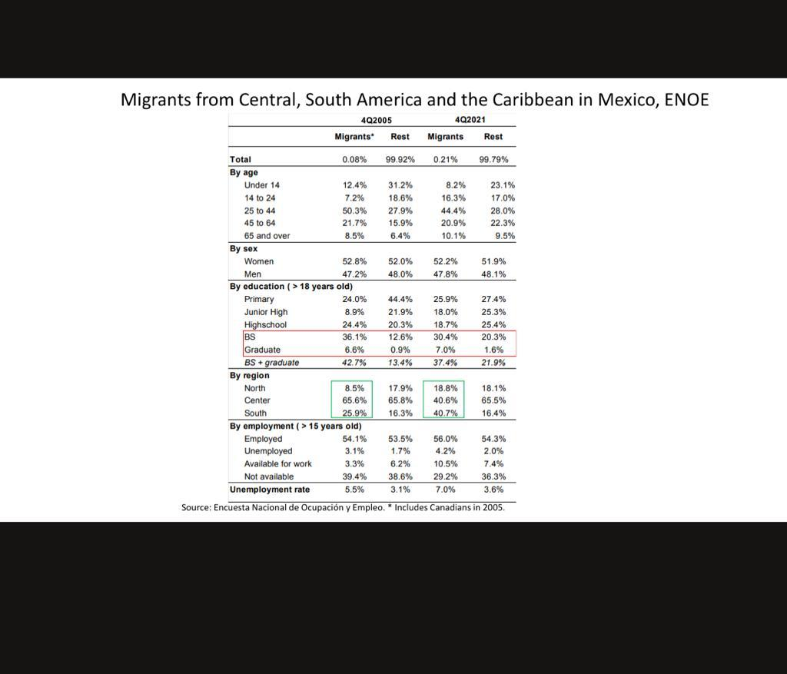

```{r setup, include=FALSE}
knitr::opts_chunk$set(echo = TRUE)
```


# Intro

El proposito de este script es que logremos recrear la siguiente tabla en R. Para ello debemos aprender a manipular encuestas, identificar las fuentes, aprender a manipular dataframes y si dios lo permite, mejorar esteticamente y eficientemente nuestros códigos.


El reto en honduras es armar las tablas para 2012 y 2021 con base en la encuesta pero tambien explorar los tabulados anteriores para ver si podemos construir las tablas para 2004 o 2005.
[Honduras Encuestas](https://www.ine.gob.hn/V3/ephpm/)
[Honduras datos antes 2014](http://181.115.7.199/binhnd/RpWebEngine.exe/Portal?BASE=SERSOC1&lang=ESP)

El reto en El Salvador es explorar su pagina e intentar encontrar la documentacion de las tablas. De lo contrario habría que explorar los datos en sí para rescatar.
[El salvador](http://aplicaciones.digestyc.gob.sv/Repositorio_archivos/)


# Paso 1

Instalar o cargar paquetes


```{r packages}
################################################################################
# Packages #
################################################################################


library(haven)
# For reading SAS XPT file from NHANES website
# haven::read_xpt


library(srvyr)
# For using survey weights
# survey::svydesign, svymean, svyglm

library(dplyr)
# for data wrangling, mining and manipulation

library(kableExtra)
# for output tables

library(ggplot2)
# for graphical analysis
```

# 2. Fuentes

+ Hay que identificar las fuentes para que tengamos datos del 2005 y 2021 (o al menos la ventana más amplia que tengamos)
+ Hay que explorar las bases o sus documentaciones para conocer las variables
+ Un tip es cargar los datos en formato de SPSS (extension .sav) porque ahi las columnas tienen su nombre clave pero tambien su nombre en el catálogo


```{r fuentes}
####################################
# Fuentes##   ######################
####################################

guat_21<-read_spss("https://www.ine.gob.gt/sistema/uploads/2022/02/25/20220225223211Ixu5S3WjSZsRS7ClOTc9m3KRW54lcJcd.sav")
guat_04<-read_spss("https://www.ine.gob.gt/sistema/uploads/2014/01/08/0PyTsGavWt4fUfJ8eSj0hUpMjUrZQj21.sav")

```

# 3. Preprocesamiento

Una vez identificadas las variables de interes, las filtramos con un select y las rebautizamos con nombres comunes a todo nuestro pipeline de datos.

Además en esta parte debemos crear las variables que usaremos para nuestro análisis y para las tablas: SEXO, EDAD, EDUCACION, EMPLEO.

Además hay que pensar como mostraremos la tabla para "participacion laboral feminina por pais y por grado".


```{r mineria}
 ####################################
# Mineria     ######################
####################################

# Variables a definir
guat_filt_21<- guat_21 %>%
  # filtro de variables de interes
  select(FACTOR,PPA03,PPA02,P03A05A,P03A05B,PPA06) 
names(guat_filt_21)<-c("FACTOR","EDAD","SEXO","NIVEL","GRADO","ETNI")

guat_filt_21<-guat_filt_21%>% 
  # agrego un identificador unico para cada observacin
  mutate(id = row_number(),
  # Aqui manipulo la variable etnididad para que tenga un 0 si no son poblaciones indigenas y un 1 si si son
  # En la documentacion puedo observar que 3 y 4 son etiquetas para mestizos y extranjeros, mientras que el resto son etnias
         ETNI = ifelse(ETNI  %in% c(3,4) | is.na(ETNI) ,0,1),
         EDAD_FACTOR = cut(EDAD, breaks = c(-Inf,13,24,44,64,Inf), labels = c("Under 14","14 to 24","25 to 44","45 to 64","65 and over")),
         NIVEL_FACTOR= cut(NIVEL, breaks = c(-Inf,2,3,4,5,Inf), labels = c("Primary(and less)","Junior High","Highschool","BS","Graduate")))


  # Finalmente bautizo con nombres mas fáciles                                                          
# Notamos NAs


guat_filt_04<- guat_04 %>%
  select(FACTOR,PPA03,PPA02,P03A07A,P03A07B,P03A03)  
names(guat_filt_04)<-c("FACTOR","EDAD","SEXO","NIVEL","GRADO","ETNI")

guat_filt_04<-guat_filt_04 %>% 
  mutate(id = row_number(),
         ETNI = ifelse(ETNI %in% c(8,6) | is.na(ETNI),0,1),
         EDAD_FACTOR = cut(EDAD, breaks = c(-Inf,13,24,44,64,Inf), labels = c("Under 14","14 to 24","25 to 44","45 to 64","65 and over")),
         NIVEL_FACTOR= cut(NIVEL-1, breaks = c(-Inf,2,3,4,5,Inf), labels = c("Primary(and less)","Junior High","Highschool","BS","Graduate")))
```

# 4. Manipulación de encuestas.

Para poder aprovechar las encuestas de  la misma manera que hace STATA necesitamos un paquete que aproveche los weights.
Hay varios, aqui usaremos *srvyr*. Primero necesitamos hacer un *srvyr objetc* con el comando *as_survey_design* que convierte a nuestra tabla una tabla pero con codificacion de encuesta, de esta manera podemos aprovechar los pesos. Después, podemos sacar proporciones adecuadas al peso de manera muy *tidy* (es decir con todas las herramientas clasicas de tidyverse).

```{r encuestas}

################################################################################
# Survey Weights #
################################################################################

# Here we use "svydesign" to assign the weights. We will use this new design
# variable "nhanesDesign" when running our analyses.

survey_21 <- guat_filt_21 %>% as_survey_design(ids = id, weight = FACTOR)
survey_04 <- guat_filt_04 %>% as_survey_design(ids = id, weight = FACTOR)


  survey_04 %>%
    group_by(SEXO) %>%
    summarize(proportion = survey_mean(),
              total = survey_total())
   survey_04 %>%
    group_by(SEXO, ETNI) %>%
    summarize(proportion = survey_mean(),
              total = survey_total())
```

Sin embargo el codigo es barroco, podemos usar funciones para obtener los mismos resultados sin escribir tanto:

```{r funciones}
# Creo 2 funciones para sacar proporciones rapidas: la primera funcion para medias univariadas y la segunda para medias condicionales de 2 variables.

media_1x<-function(survey,x){
  x <- enquo(x)
  

  survey %>%
    group_by(!! x) %>%
    summarize(proportion = survey_mean(),
              total = survey_total())  
  
}

media_2x<-function(survey,x1,x2){
  x1 <- enquo(x1)
  x2 <- enquo(x2)
  
  survey %>%
    group_by(!! x1,!! x2) %>%
    summarize(proportion = survey_mean(),
              total = survey_total())  
  
}

# Probamos las funciones
media_1x(survey_04,SEXO)
media_2x(survey_04,SEXO,ETNI)

```


# Creacion de tablas


Ahora ya tenemos todos los ingredientes necesarios para las tablas que debemos construir.
```{r tablas}

# Aqu
guat_edad_04<-media_1x(survey_04,EDAD_FACTOR) %>% select(EDAD_FACTOR, proportion)
names(guat_edad_04)<-c("By age","2004")
guat_sexo_04<-media_1x(survey_04,SEXO) %>% select(SEXO, proportion)
names(guat_sexo_04)<-c("By sex","2004")
guat_nivel_04<-media_1x(survey_04 %>% filter(EDAD >= 18),NIVEL_FACTOR)  %>% select(NIVEL_FACTOR, proportion)
names(guat_nivel_04)<-c("By education","2004")


guat_edad_21<-media_1x(survey_21,EDAD_FACTOR) %>% select(EDAD_FACTOR, proportion)
names(guat_edad_21)<-c("By age","2021")
guat_sexo_21<-media_1x(survey_21,SEXO) %>% select(SEXO, proportion)
names(guat_sexo_21)<-c("By sex","2021")
guat_nivel_21<-media_1x(survey_21 %>% filter(EDAD >= 18),NIVEL_FACTOR)  %>% select(NIVEL_FACTOR, proportion)
names(guat_nivel_21)<-c("By education","2021")


guat_edad<-merge(guat_edad_04,guat_edad_21)
guat_sexo<-merge(guat_sexo_04,guat_sexo_21)
guat_nivel<-merge(guat_nivel_04,guat_nivel_21)

tablas<-list(guat_edad,guat_sexo,guat_nivel)

```

# Output de tablas

```{r output,results='asis'}

library(kableExtra)

kable(tablas)
```


# Apendice

## Match de edad

Se descubrio que el nivel educativo en la encuesta 2004 trae un desplazo de una unidad en la categoría

```{r apendicee}
gu_21<-(media_1x(survey_21 ,NIVEL) )
gu_04<-(media_1x(survey_04,NIVEL) )

library(ggplot2)
ggplot() +
  geom_line(aes(gu_21$NIVEL, gu_21$total, color = "2021"))+
  geom_line(aes(gu_04$NIVEL, gu_04$total, color = "2094"))+ggtitle("Nivel educativo en cada encuesta")

ggplot() +
  geom_line(aes(gu_21$NIVEL, gu_21$total, color = "2021"))+
  geom_line(aes(gu_04$NIVEL-1, gu_04$total, color = "2004"))+ggtitle("Nivel educativo en cada encuesta corrección")
```
  
  
Aqui hay que reordenar las escolaridad, se descubrió que hay una relacion entre su categoria con la nuestra de la siguiente manera

### Relacion escoladidad: Encuesta 2021 

| Guat | Mex |
|-|-|
|0|1|
|1|1| 
|2|1| 
|3|2| 
|4|3| 
|5|4|
|6|5|
|7|5|

### Relacion escoladidad: Encuesta 2004 sin correcion

| Guat | Mex |
|-|-|
|1|1|
|2|1| 
|3|1| 
|4|2| 
|5|3| 
|6|4|
|7|5|

### Relacion escoladidad: Encuesta 2004 con correcion
| Guat | Mex |
|-|-|
|0|1|
|1|1| 
|2|1| 
|3|2| 
|4|3| 
|5|4|
|6|5|